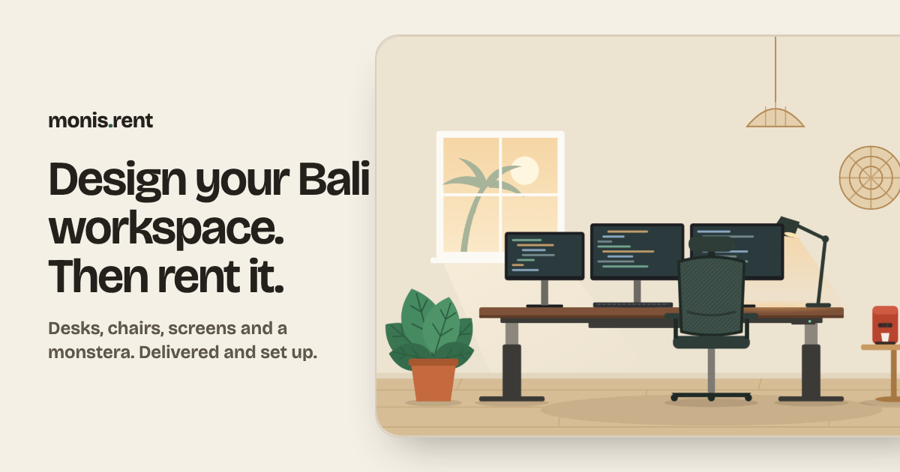

# monis.rent Workspace Designer

Build a desk setup for your time in Bali, watch it come together in a little villa room lit by the real time of day there, then rent it.

**Live:** [bali-workspace-designer.vercel.app](https://bali-workspace-designer.vercel.app) · Built for the [Desent](https://www.desent.io) coding challenge.



## Approach

The brief's persona has just landed, needs a desk by next week, and doesn't want to read a spec sheet. The app is built around four ideas:

1. **Show, don't list.** The preview is the main thing on screen. Every choice lands in it right away: the desk swaps, monitors drop onto the desk and shuffle over to make room, the lamp switches on, a standing desk rises when you press _Stand_.
2. **Lit by Bali time.** The room follows the real time of day in Bali: morning light, midday, sunset, then night with the lamps and screens glowing. Someone browsing from Berlin at midnight sees their future desk at breakfast time in Canggu, and can preview any hour.
3. **The bill builds itself.** Next to the room sits a paper rental slip that prints a new line for every change. It ends with a barcode of your share code and the earliest day it can be set up, and gets stamped when you send the request.
4. **Remove decisions.** Three starter setups (based on monis.rent's real bundles) give you a sensible office in one tap. The desk you pick decides how many screens fit, and the UI says so ("Desk is full") instead of silently refusing.

Smaller things that came from thinking as the user:

- **A closer look before committing.** Tap any product's picture for a sheet with the real monis.rent photo (where they stock that exact item), the key facts, and why renting it makes sense.
- **Shareable setups.** The URL always describes the current setup (`?s=std.pro.m27x2.lamp`), short enough to paste into a chat with a co-founder. The checkout page reads the same link on the server.
- **Checkout asks only what a delivery needs:** how long, where, when, who, and how to reach you. Longer terms show the discount up front. Nothing is charged; a person confirms stock and a delivery slot first.
- **On phones** the preview stays pinned at the top while you pick, with its controls in a strip below it so the room is never covered, and a bottom bar keeps the total and "Rent this setup" in reach.

## Tech choices

|               | Choice                                                                                             | Why                                                                                                                                                                              |
| ------------- | -------------------------------------------------------------------------------------------------- | -------------------------------------------------------------------------------------------------------------------------------------------------------------------------------- |
| Framework     | Next.js 16 (App Router), TypeScript strict                                                         | Required by the brief. The designer page is fully static; checkout is server-rendered from the URL.                                                                              |
| Styling       | Tailwind CSS v4 with design tokens in `globals.css`                                                | Required. A light and a dark theme (lime-wash, lagoon, frangipani) from the same tokens; the room's lighting lives separately in `scene.css`.                                    |
| Illustrations | Hand-built SVG components                                                                          | One consistent style, no image files to load, and every part can move on its own. Product thumbnails reuse the same parts, so what you tap is what lands in the room.            |
| Lighting      | CSS variables per time of day, a multiplied tint and a screen-blended lights layer                 | Furniture keeps its colours, so a new product is drawn once, not four times. The time of day is set before first paint by a tiny inline script.                                  |
| State         | `useState` + a pure reducer, shared through context                                                | The state is small. Pure functions (`reducer`, `rules`, `pricing`, `codec`) hold the logic and are unit tested without React.                                                    |
| Fonts         | Young Serif (headings), Atkinson Hyperlegible (body), Atkinson Hyperlegible Mono (slip and prices) | `display: optional` with metric-matched fallbacks: no layout shift, no late repaint.                                                                                             |
| Motion        | CSS only: transitions plus a spring curve written with `linear()`                                  | I started with Motion and swapped it out: everything here animates `transform`/`opacity`, which CSS does on the compositor, and dropping the library saved ~40 kB of JavaScript. |
| Testing       | Vitest + Testing Library, Playwright + axe                                                         | Logic and interaction tests; end-to-end flows on desktop and phone, including keyboard-only use; zero axe violations in both themes.                                             |

## Accessibility

- Pickers are native radio buttons and checkboxes under the styling, so arrow keys, Space and screen readers work without custom code. Each card is named by the product alone ("Oak writing desk, radio button, 1 of 3"), with the details read after.
- The step tabs follow the WAI-ARIA tabs pattern (arrow keys, Home/End). The details sheet is a native modal dialog: focus moves in, Esc closes, focus returns to the card.
- The preview has a live text description ("140 cm electric standing desk, raised to standing height, with an ergonomic mesh chair, two 27-inch monitors… Shown at night, with the lights on."), and every change is announced politely ("Added monstera. Weekly total $46.50.").
- Buttons that can't act right now stay focusable and explain why (`aria-disabled` plus a hint) instead of going dead.
- Form errors are linked to their fields, and focus moves to the first problem, then to the confirmation.
- `prefers-reduced-motion` turns off all motion. Body text uses Atkinson Hyperlegible (designed for low-vision readers). Colour pairs meet WCAG AA, with AAA for body text. The layout reflows down to 320 px, and the pinned mobile preview never hides the focused element (WCAG 2.4.11).

## Performance

Lighthouse on the live site: **100 / 100 / 100 / 100 on desktop**, and 99–100 / 100 / 100 / 100 on mobile (it varies between runs). What got it there: a static page, inline SVG instead of images, CSS-only motion, fonts that never trigger a late repaint, and the product sheet's code loaded only when someone opens it.

## Running it

```bash
pnpm install
pnpm dev            # http://localhost:3000
pnpm check          # lint + typecheck + unit tests
pnpm test:e2e       # Playwright on a production build (desktop + phone, includes axe)
pnpm lighthouse     # Lighthouse CI against a production build
```

## Project layout

```
src/
  catalog/      products, details and starter setups (the only place to add a product)
  setup/        setup state: reducer, rules (monitor capacity), pricing, URL codec, a11y text
  scene/        Bali time of day for the room's lighting
  theme/        light/dark/system theme, applied before first paint
  checkout/     request form fields, Bali-time dates, validation
  components/
    stage/      the SVG room: layout math + one file per group of parts
    designer/   step tabs, product cards, details sheet, starter setups
    sheet/      rental slip and mobile bar
    checkout/   request form and confirmation
  app/          routes, metadata, OG image, robots/sitemap/manifest, scene.css
```

To add a product: add it to `src/catalog/products.ts`, then draw it in `src/components/stage/parts/`.

## What I'd improve with more time

- **Real availability.** Stock is per area and per date, so the picker should say "out in Ubud next Tuesday" before checkout, not after. That needs an inventory API, and it changes the design: availability would grey out cards rather than fail the request.
- **A real request backend.** The form posts nowhere today. Next step is a server action that hands the request to the ops team's tool (and WhatsApp), then a deposit with Stripe once a request is confirmed.
- **Photos for everything.** Six products are illustrated only, because monis.rent doesn't stock those exact items. With their real catalogue I'd match the products to what they actually rent.
- **Arrange the desk yourself.** Drag items to reposition them, and a top-down view for people who care where the plant goes. The layout math is already isolated in `stage/layout.ts`, which makes this a contained change.
- **IDR prices and Bahasa Indonesia**, for local startups as well as visitors.
- **A real-device accessibility pass.** Automated checks (axe, keyboard e2e, the accessibility tree) are clean, but I'd still want a session with VoiceOver on iOS and TalkBack on Android, ideally with a screen-reader user.
